# EN02-OP

EN02-OP is the Open Source 3-Finger End-Effector created by Westwood Robotics and equiped on our full-size humanoid robot THEMIS. A very simple yet versital 7DoF design is adopter, enabling the end-effector to change into the best poses for all kinds of items. \
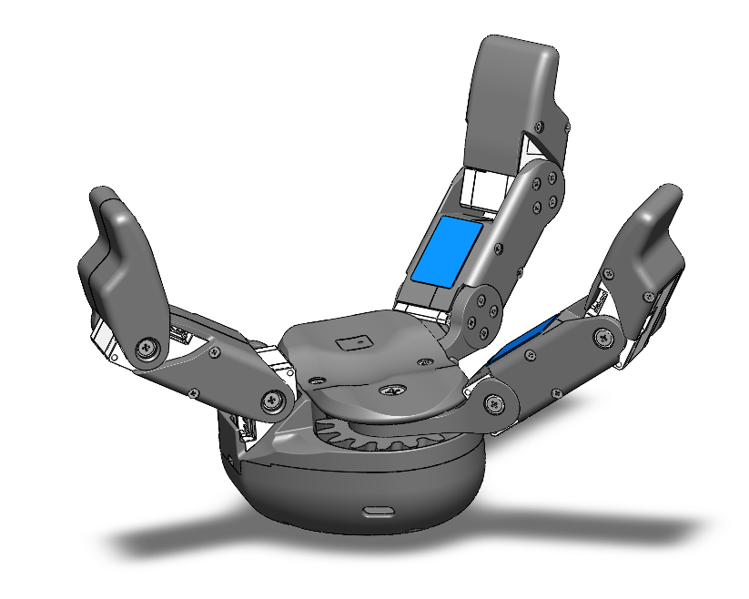 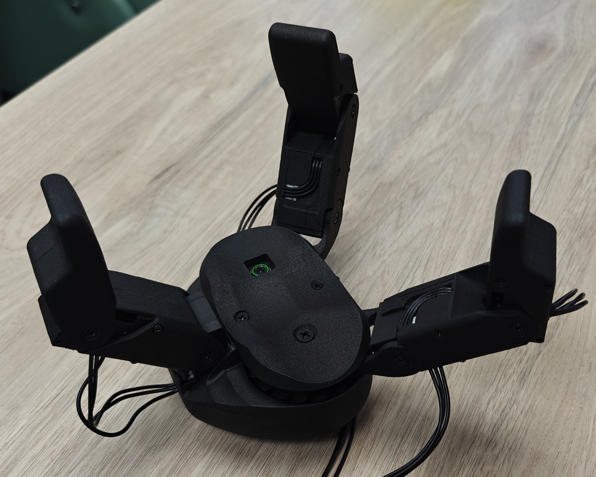 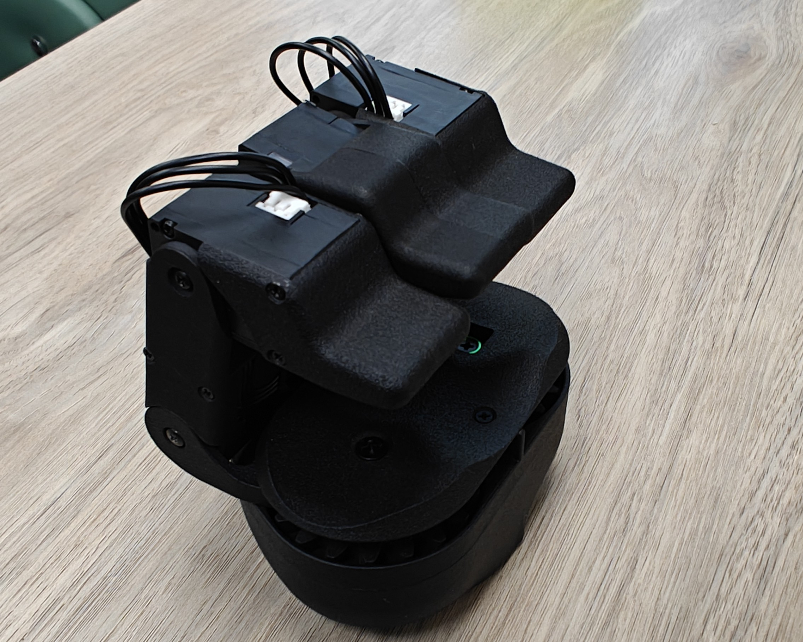\
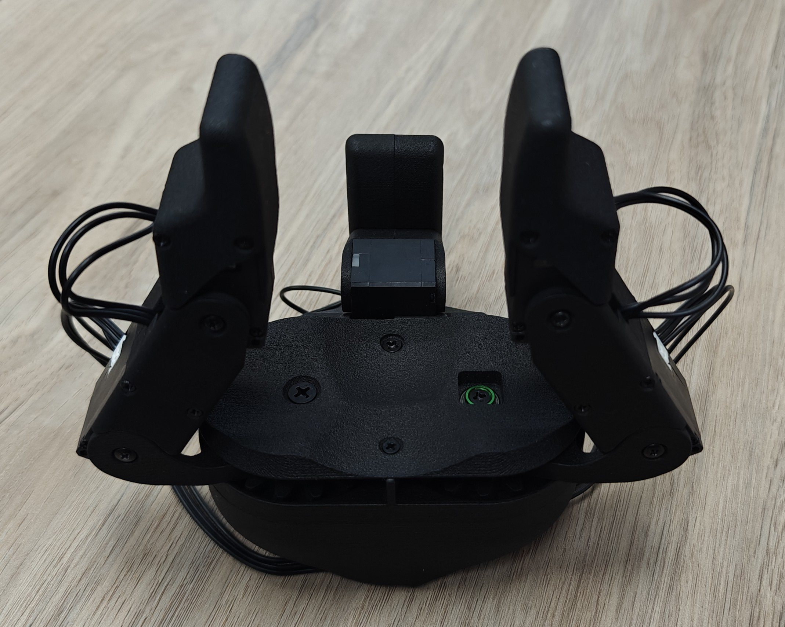 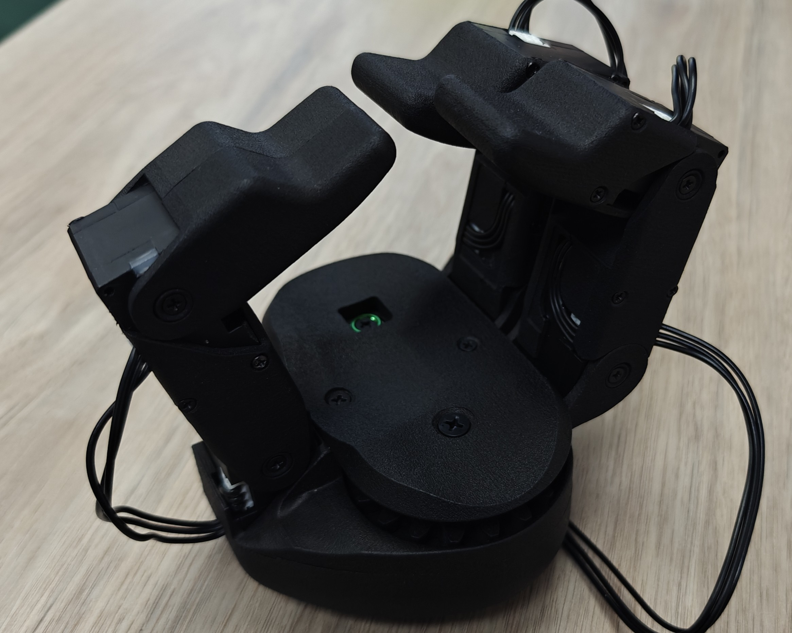 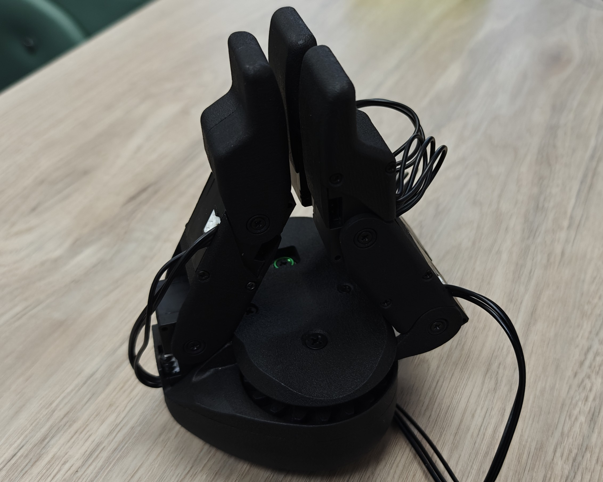\
Most parts on EN02-OP can be 3D printed, and all hadrware is standard and avalible off-the-shelf. The standard actuators on EN02-OP are the XC-330-M288-T($98.89/ea) from Dynamixel, but if the anticipated payload is realtively small, XL-330($26.29/ea) can be adopted for lower cost.

[Contact us](https://www.westwoodrobotics.io/contact/) to order an official version, or ***Build your EN02-OP for as low as $200!*** \
 (Cost estimation based on using XL-330 for all 7DoF, parts printed with generic PLA material and Bambu PAHT-CF, and EN02OP-PWR PCBA assembled in-house. Tools and equipment not included.)  

## Before You Start
### Know The Design
> [!IMPORTANT]
> Modify EN02-PALM_BASE to fit your system before printing.

> [!NOTE]
> Use fiber reinforced materials for parts in */Design/Parts_to_Print/CF_Reinforced/*

All design files of EN02-OP is included in [EN02-OP.STEP](/Design/EN02-OP.STEP). To make import easier, the 3D model of EN02OP-PWR(Board for voltage regulation and communication ports) is excluded from the model and provided seperatly in [EN02-PWR.step](/Design/EN02-PWR.step). Refer to [EN02-OP-BOM.xls](/Design/EN02-OP-BOM.xls) for the complete BOM of EN02-OP.

For your convenient, all parts that can be 3D printed are included in the [/Design/Parts_to_Print](/Design/Parts_to_Print/) folder. \
Feel free to go with your favorate materials for the parts in the [../Parts_to_Print/General](/Design/Parts_to_Print/General/) folder, such as PLA, PETG, ABS and Nylon, but it is highly recommended to print the parts in the [../Parts_to_Print/CF_Reinforced](/Design/Parts_to_Print/CF_Reinforced/) folder with carbon fiber/glass fiber reinforced materials for better strength and durability, such as Bambu PAHT-CF. The parts are highlighted in blue in the picture below:\
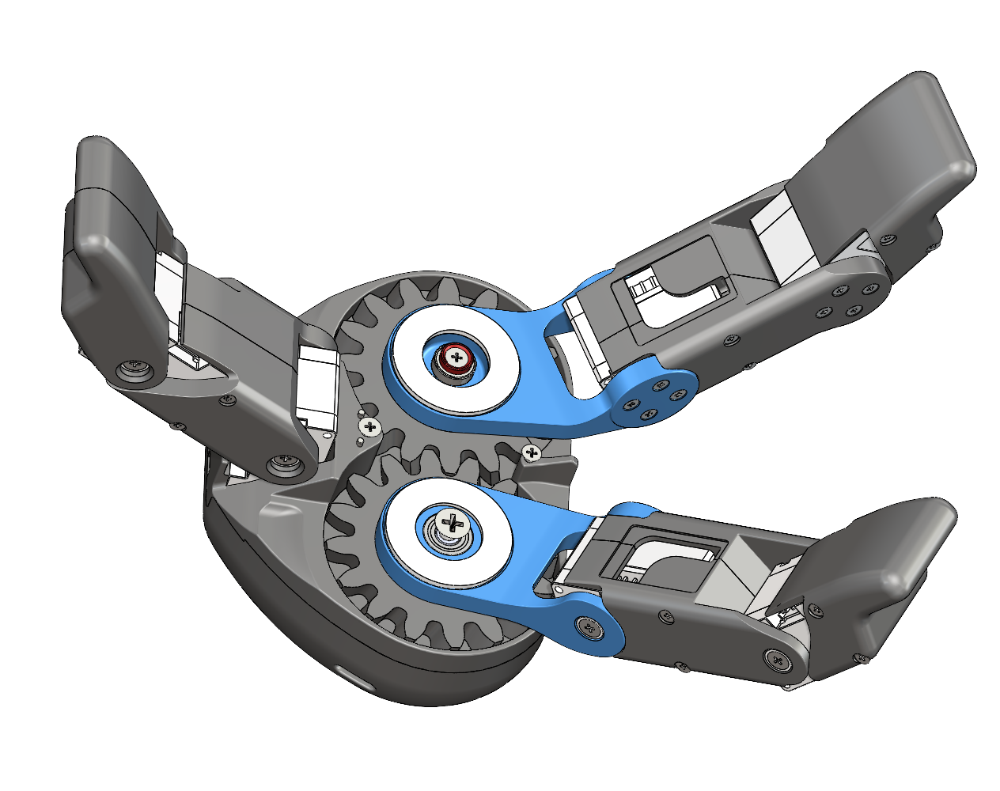

**Modify [EN02-PALM_BASE](/Design/Parts_to_Print/General/Modify_Before_Printing/EN02-PALM_BASE.STEP) before printing!** \
EN02-OP is designed to be located and mounted onto robot manipulators using the plane with circular profile on the bottom, as highlighted in blue in the piture below. Mounting holes have been removed intentionally, so please modify the part and add mounting holes in a pattern that matches your robot manipulator before printing it.\
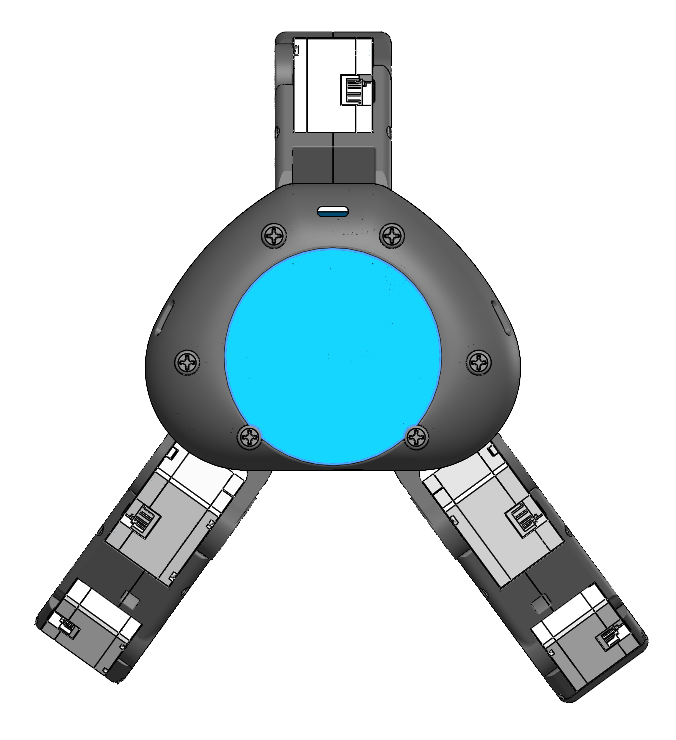

### Electronics 
Electronics on EN02-OP is fairly simple and there is only one PCBA to fabracate which is the EN02-PWR. The XL/XC-330-M288-T actuators take 5V as input and their communication protocal is TTL. There is a 20~36V to 5V/10A regulator on EN02-PWR, making it compatible with the DC power supply on a large range of robot systems. It also takes care of chaining the fingers together. 

All related files are included in the [/Electronics](/Electronics) folder. Send [EN02OP-PWR-Gerber.zip](/Electronics/EN02OP-PWR-Gerber.zip) to your PCB manufacture to make the PCB board, and all components needed are listed in [EN02OP-PWR-BOM.xlsx](/Electronics/EN02OP-PWR-BOM.xlsx). Refer to [EN02OP-PWR.pdf](/Electronics/EN02OP-PWR.pdf) for the scheme of the board.

You can purchase pre-assembled EN02OP-PWR from us for $35/ea. Contact us at: https://www.westwoodrobotics.io/contact/

Each XL/XC-330 actuator comes with one pre-assembled cable. Cables with the same crimp and headers(JST EHR-03) in various length can also be found on Amazon and Ebay for affordable prices.
#### Can I modify EN02-PWR to support 12V systems?
Other models of XC330 actuators such as the T288 and the T181 models require 12V power supply, and EN02-PWR can be easily modified by relacing several components to support 12V. Please refer to tab "BOM_12V_EN02OP" in [EN02OP-PWR-BOM.xlsx](/Electronics/EN02OP-PWR-BOM.xlsx) for a full BOM for 12V output, and the items that are different from 5V setup has been highlighted.
> [!IMPORTANT]
> Make sure to always test the output of your EN02-PWR before using it. Avoid powering 5V actuators with 12V power supply.

> [!NOTE]
> The pre-assembled EN02OP-PWR from Westwood Robotics is 5V. You will need to modify the components according to BOM_12V_EN02OP by yourself if 12V is needed instead of 5V. Please note that any modification will void the board's warranty. 

## Assembly Notes
It can be tricky when comes to cable management, and we suggest to route the cables for the actuators on EN02-OP as following:\

a. Route the cable between the two actuators on the index fingers as shwon in the image below with the red line, then cover the cable on the inside of the *INDEX_MIDDLE_PHALANX* with foam tape of 0.5mm or 1mm thickness, as highlighted in blue:\
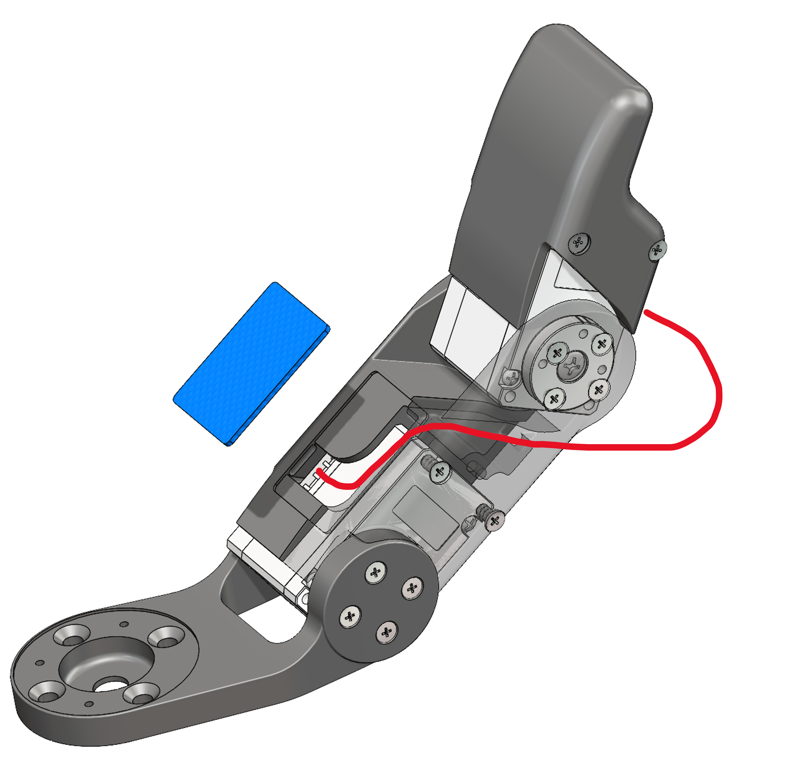

b. As indicated with the orange line, thread the cable from the back of the actuator on the *INDEX_MIDDLE_PHALANX* into the *PALM_BASE* via the openning, and connect it to the port on EN02-PWR:\
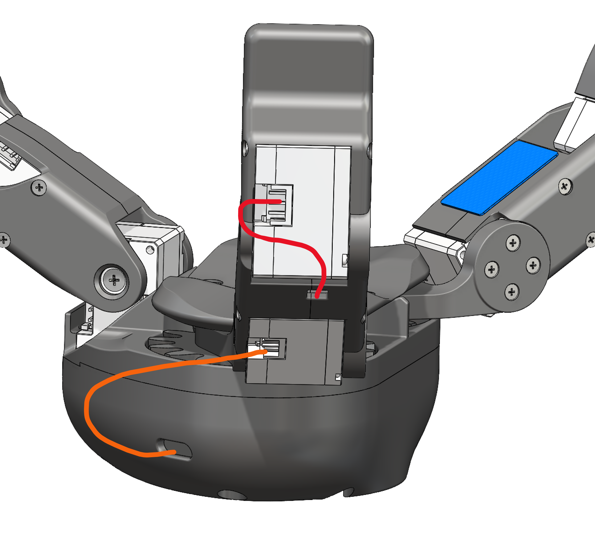

c. As indicated with the red line, thread the cable from the back of the actuator on the *THUMB_MIDDLE_PHALANX* to the actuator on the base joint, and connect the actuator on the base joint to the actuator in the palm as indicated with orange line. Connect the actuator in the palm to the port on EN02-PWR:\
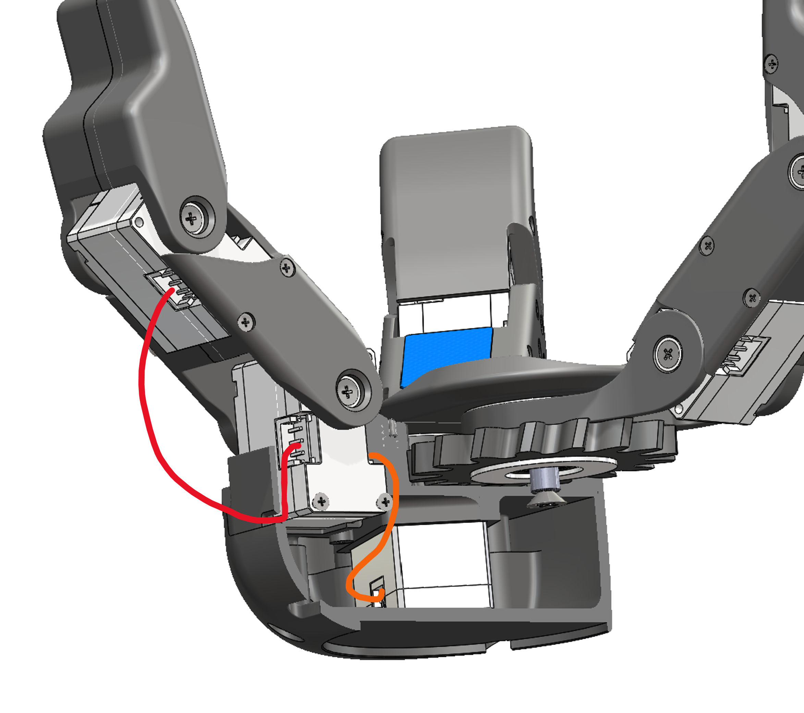
> [!TIP]
> Connect the cables to the base joint actuator first and thread them through the designed passage on *PALM_MIDHOUSING* while inserting the actautor into *PALM_MIDHOUSING*.

## Control Software
There is no dedicated control software for EN02-OP at the moment. It is realatively easy to work with given its simple structure, and please refer to https://emanual.robotis.com/docs/en/dxl/x/xc330-m288/ for more information on how to work with Dynamixel actuators.

## Licensing
The work in this repo is under GNU General Public License (GPL) version 3, which is ideal for use cases such as open-source projects with open-source distribution, student/academic purposes, hobby projects, internal research projects without external distribution, or other projects where all GPL obligations can be met. Read the full text of [the GNU GPL version 3](https://www.gnu.org/licenses/gpl-3.0.html) for details.  

Contact us for commercial license should you need full rights to create and distribute the platform on your own terms without any open-source license obligations.

## Future Work
Assembly videos will be uploaded.

